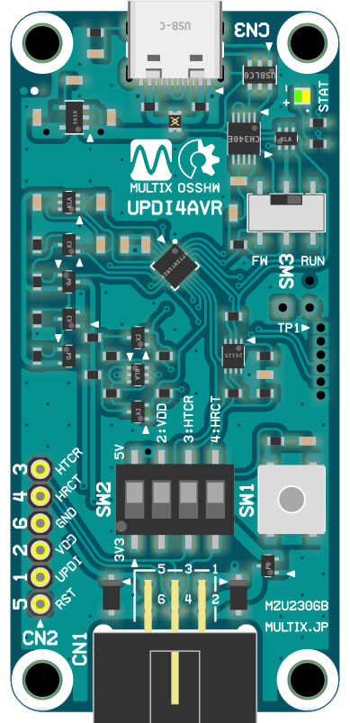
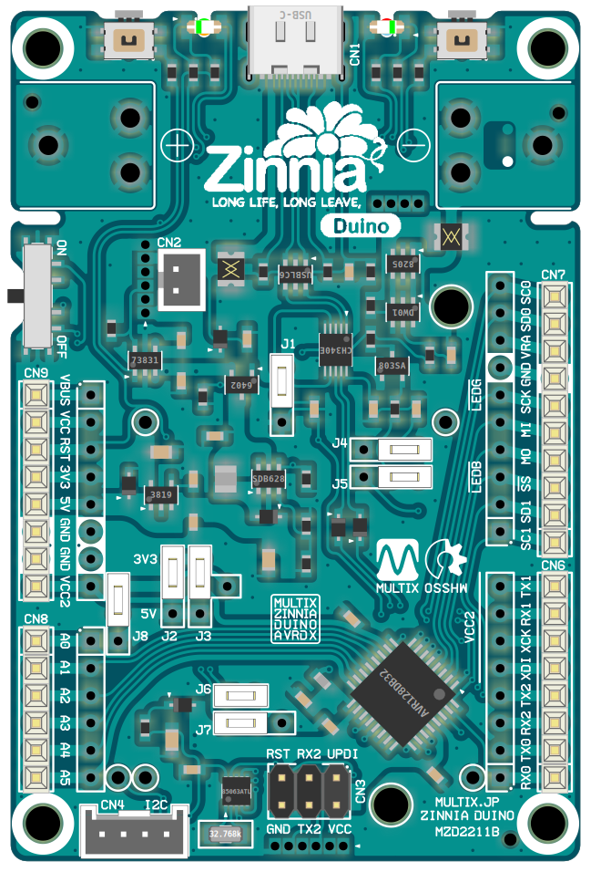
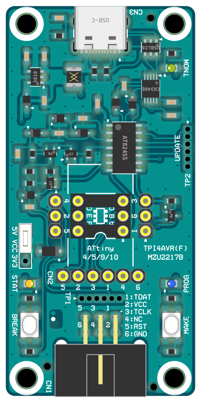
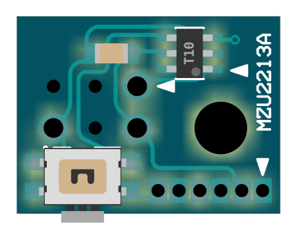

# MultiX Zinnia Product : All Open Source Software / Hardware

## MultiX Zinnia Product SDK [*AVR] for Arduino IDE

This software development kit is primarily for the new generation AVR family.
(Announced after Microchip brand integration)
Configured to aid development in the Arduino IDE.
C/C++/Assembler programs written in AVR-GCC/AVR-LIBC
It provides a workflow up to uploading to the target MCU using avrdude.

__WARNING: Arduino compatible API is not provided.__

- Please add the following link to your Arduino IDE preferences.\
  [`https://askn37.github.io/package_multix_zinnia_index.json`](https://askn37.github.io/package_multix_zinnia_index.json)
- Then search for `multix` in Boards Manager.
- Select the desired architecture and install.\
  `megaAVR` / `modernAVR` / `reduceAVR` / `UPDI4AVR`
- [For more information](https://github.com/askn37/askn37.github.io/wiki/InformationSDK) (ja-JP)

## Firmware "JTAG2UPDI" (Clone) : UPDI NVM Reader/Writer Firmware for Arduino Compatible

- JTAG2UPDI clone with support for NVMCTRL versions 0, 2, 3, and 5
- Installation board: Arduino UNO Rev.3, UNO Wifi Rev.2 etc.
- Target AVR: tinyAVR-0/1/2, megaAVR-0, AVR_DA/DB/DD/EA/EB
- [For repository](https://github.com/askn37/jtag2updi/)

## Product "UPDI4AVR" : UPDI Programmer Writer with High-Voltage Activation

- UPDI programmer writer with HV activation. (66x31mm)
- It can also be reset without destroying the functionality of the target MCU's UPDI pin.
- Compatible with all Microchip AVR DA/DB/DD/EA/EB, Atmel tinyAVR-0/1/2 and megaAVR-0 series.
- [For more information (ja-JP)](product/UPDI4AVR)
[(en-US)](product/UPDI4AVR/README_en.html)

## Product "Duino" : modernAVR Board with Battery Powered

- Battery powered board with modernAVR. (79x53mm)
- Adopts Microchip AVR DA/DB/DD or Atmel ATmega**08 series. (TQFP32)
- Equipped with Li-ion battery charger and protection circuit.
- The battery voltage can be boosted to 5V or left alone.
- Additional On-board calendar IC.
- Arduino compatible external pin layout.
- x1 Grove/M5 compatible I2C connector.
- [For more information](product/Duino) (ja-JP)

## Product "TPI4AVR" : TPI Programmer Writer with High-Voltage Activation

- TPI programmer writer with HV activation. (66x32mm)
- Additional SOT-23 conversion sockets can be added and signals can be extracted.
- Compatible with Atmel ATTiny4/5/9/10, ATtiny20/40 and ATtiny102/104 series.
- [For more information](product/TPI4AVR) (ja-JP)

## Product "UPDI Reset Plus" Snap-On Circuit

- Additional circuitry that allows the UPDI pin to be a RESET button. (16x12mm)
- It's convenient because you don't have to lose the functionality of the UPDI pin.
- [For more information](product/URP) (ja-JP)

## Copyright and Contact

Twitter: [@askn37](https://twitter.com/askn37) \
GitHub: [https://github.com/askn37/](https://github.com/askn37/) \
Product: [https://askn37.github.io/](https://askn37.github.io/)

Copyright (c) askn (K.Sato) multix.jp \
Released under the MIT license \
[https://opensource.org/licenses/mit-license.php](https://opensource.org/licenses/mit-license.php) \
[https://www.oshwa.org/](https://www.oshwa.org/)
