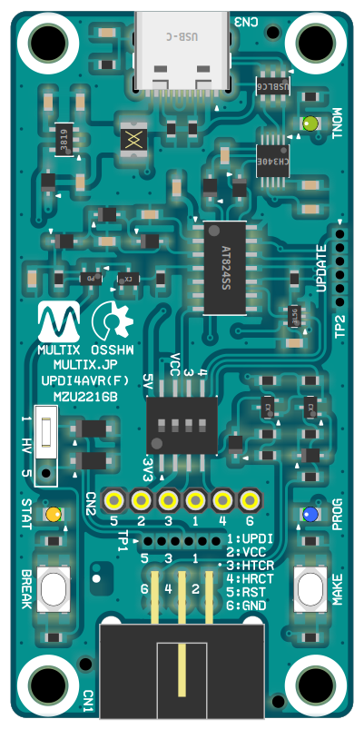

# Multix Zinnia Product : All Open-Source / Open-Hardware

## Multix Zinnia Product SDK [*AVR] for Arduino IDE

- Please add the following link to your Arduino IDE preferences.\
  [`https://askn37.github.io/package_multix_zinnia_index.json`](https://askn37.github.io/package_multix_zinnia_index.json)
- Then search for `multix` in Boards Manager.
- Select the desired architecture and install.\
  `megaAVR` `modernAVR` `reduceAVR`
- [For more information](https://github.com/askn37/askn37.github.io/wiki/InformationSDK) (ja-JP)

## Product "Duino" : modernAVR Board with Battery Powered

- Battery powered board with modernAVR. (79x53mm)
- Adopts Microchip AVR DA/DB/DD or Atmel ATmega**08 series. (TQFP32)
- Equipped with Li-ion battery charger and protection circuit.
- The battery voltage can be boosted to 5V or left alone.
- Additional On-board calendar IC.
- Arduino compatible external pin layout.
- x1 Grove/M5 compatible I2C connector.
- [For more information](product/Duino) (ja-JP)

## Product "UPDI4AVR" : UPDI Programer Writer with High-Voltage Activation

- UPDI programmer writer with HV activation. (66x32mm)
- It can also be reset without destroying the functionality of the target MCU's UPDI pin.
- Compatible with all Microchip AVR DA/DB/DD, Atmel tinyAVR-0/1/2 and megaAVR-0 series.
- [For more information](product/UPDI4AVR) (ja-JP)

## Product "TPI4AVR" : TPI Programer Writer with High-Voltage Activation

- TPI programmer writer with HV activation. (66x32mm)
- Additional SOT-23 conversion sockets can be added and signals can be extracted.
- Compatible with Atmel ATTiny4/5/9/10, ATtiny20/40 and ATtiny102/104 series.
- [For more information](product/TPI4AVR) (ja-JP)

## Product "UPDI Reset Plus" Snap-On Circuit

- Additional circuitry that allows the UPDI pin to be a RESET button. (16x12mm)
- It's convenient because you don't have to lose the functionality of the UPDI pin.
- [For more information](product/URP) (ja-JP)

## Copyright and Contact

Twitter: [@askn37](https://twitter.com/askn37) \
GitHub: [https://github.com/askn37/](https://github.com/askn37/) \
Product: [https://askn37.github.io/](https://askn37.github.io/)

Copyright (c) askn (K.Sato) multix.jp \
Released under the MIT license \
[https://opensource.org/licenses/mit-license.php](https://opensource.org/licenses/mit-license.php) \
[https://www.oshwa.org/](https://www.oshwa.org/)
