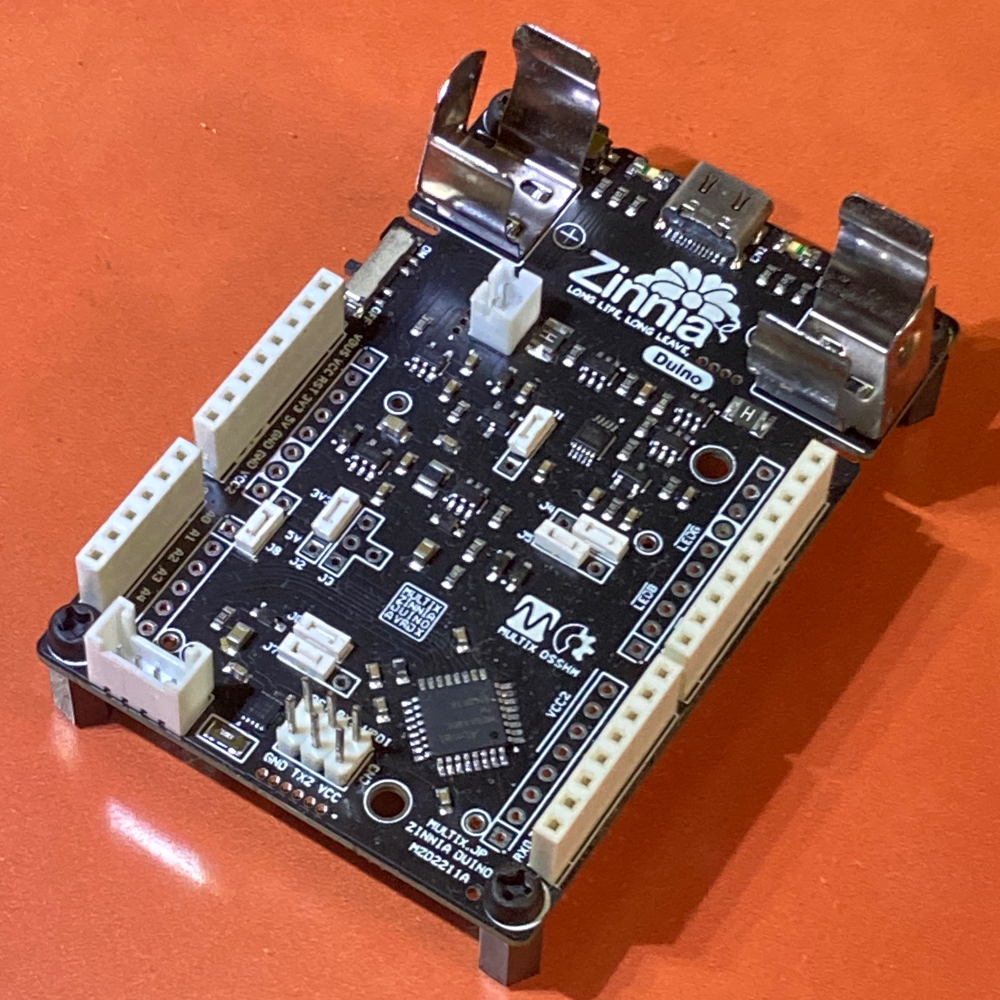
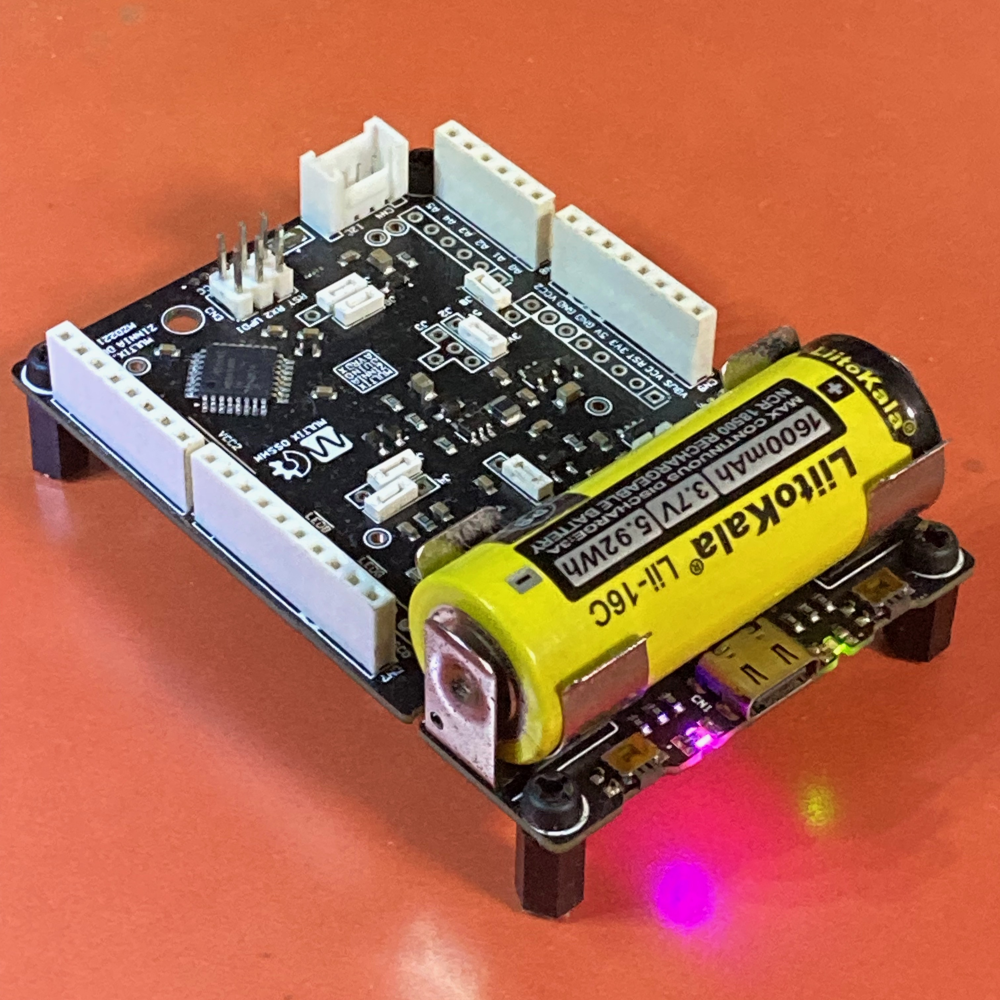
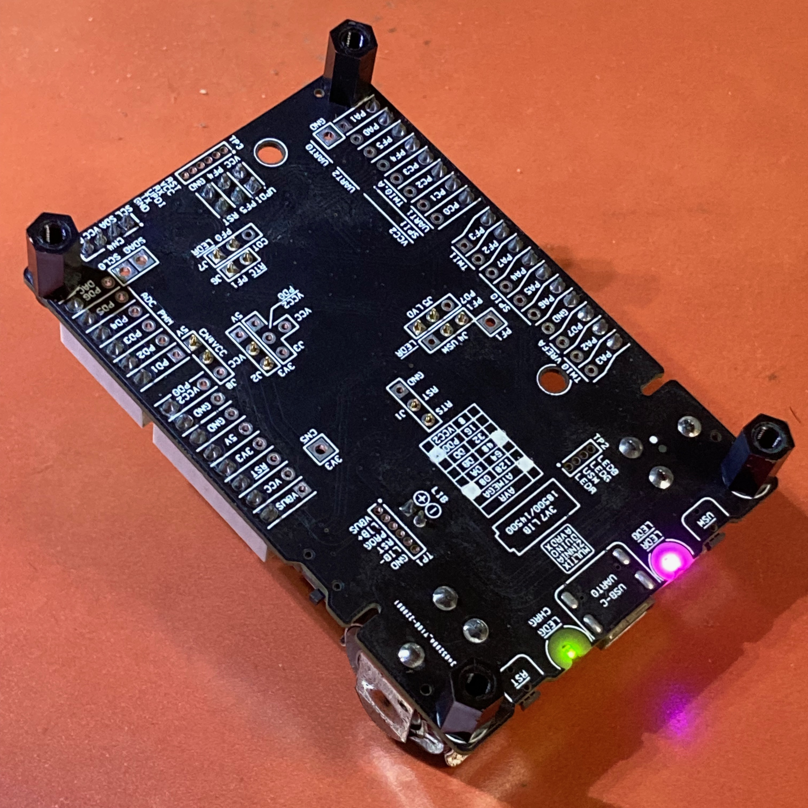
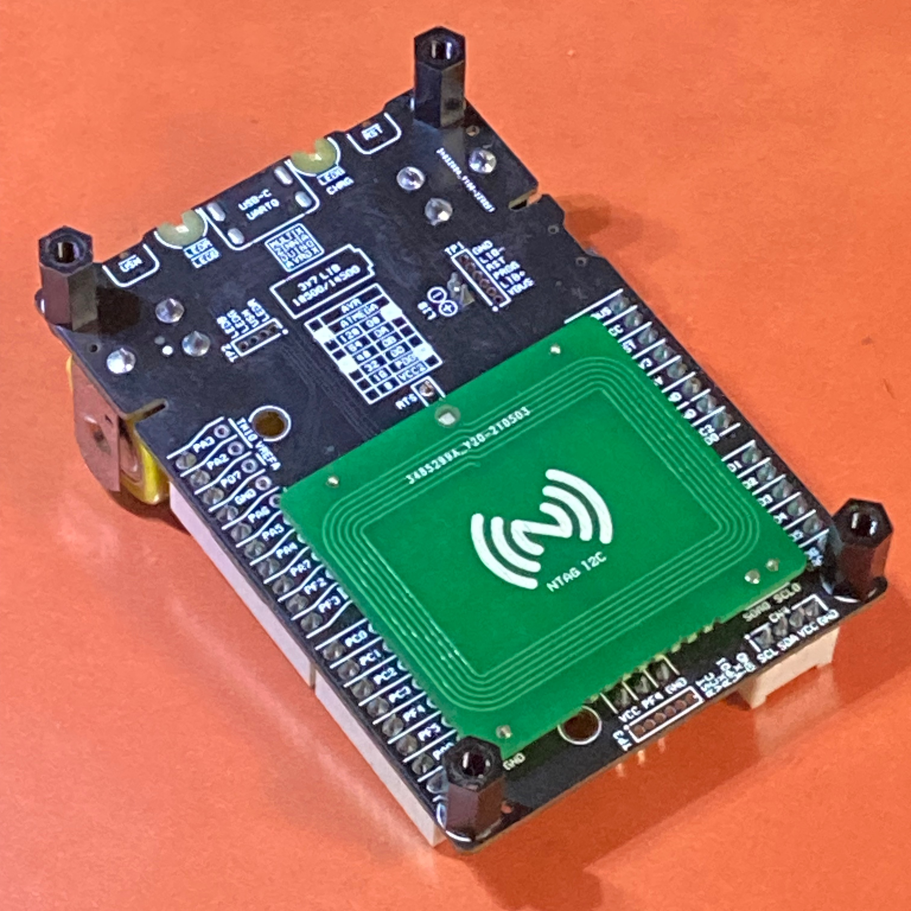
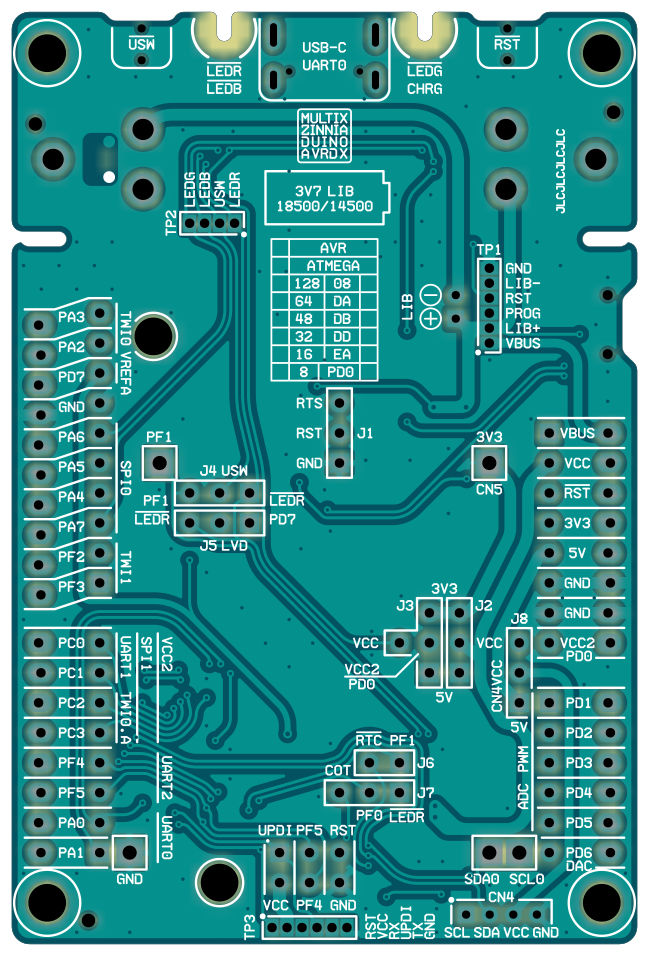
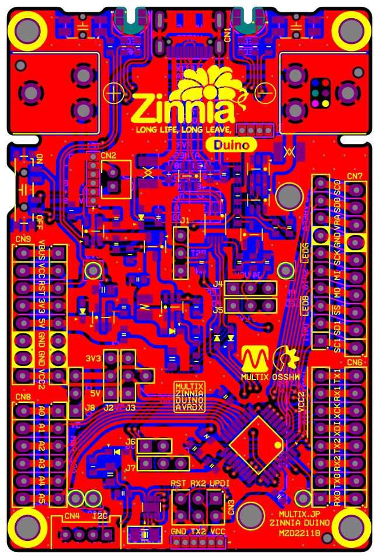

# Multix Zinnia "Duino" : modernAVR Board with Battery Powered

> 写真は試作品

- TQFP32外囲器の `megaAVR-0` `AVR DA` `AVR DB` `AVR DD`シリーズに対応した Arduino互換型ボード
- 基板寸法 79x53mm
  - 4隅に M3マウントホール
  - TAKACHI SW-85 プラスチックケースにちょうど入る大きさ
  - TAKACHI TWN7-4-11 プラスチックケース、西務良 ブレッドボード用PETケース も選択可能
- WCH CH340E + USB(2.0) Type-C コネクタ経由で PCと接続
  - Type-C レセクタプルはショート型でケース格納時に干渉しにくい
  - ブートローダー経由のスケッチアップロード
  - MIL/6PコネクタからのUPDIアップロード
  - PCからの自動リセットを キャンセル選択可能

- 18500サイズのリチウムイオン充電池をクリップオンで搭載可能
  - 過充電/過放電保護回路付
  - 14500サイズ（単三電池型）もスペーサーを嵌めることで対応可能
  - LiPo電池用 JST-PH 2ピン縦型コネクタも搭載して排他選択可能
- 5V昇圧回路付
  - 側面スライドスイッチで`昇圧あり`/`昇圧なし`/`給電オフ`を選択可能
- Grove/M5互換縦型 I2Cコネクタ 1個付
  - 外部デバイスへの電源供給は 3.3V固定/3.7V〜5V昇圧固定/MCU電圧一致の3択

- 裏面照射LED 4個（2色2個）
  - 240度以上の広視野角で多方向から視認可能
  - 蛍光剤入基板基剤による発光と併せて高視認性を実現
  - ユーザー制御可能な `BLUE` と `GREEN`
  - ユーザー制御と 低電圧検出表示兼用の `RED`
  - 充電状態専用の `YELLOW ORANGE`
- 横方向タクトスイッチ2個
  - ユーザー制御と カレンダーIC割込兼用の 1個
  - ユーザー制御と MCUリセット排他選択の 1個

- I2C制御カレンダーIC付
  - アラーム割込/長周期タイマー割込を設定して、深い休止状態からの定期/任意間欠駆動が可能
- 低電圧検出IC付
  - 電池残量低下を割込通知
- GPIO追加スルーホール列
  - Arduinoソケットとは別に、秋月C型/D型ユニバーサル基板を増設可能
  - スプリングジャンパーワイヤ、MAC-8 コンスルー使用可能
- 裏面増設 I2Cコンタクト
  - スマートホンの NTAG カードリーダーで非接触読取可能な パッシブRFIDタグ基板を増設可能（開発中）
  - 13.56MHz帯 1mW未満 総務省指定特定小電力分類 最大通信距離5cm未満（予定）
  - RFIDタグ内容（EEPROM/SRAM）は I2C経由で書換可能

## 設計情報

### 部品実装イメージ

### レイヤー構成

> 色付レイヤーをクリックするとそのレイヤーが非表示になる。黒地をクリックすると初期状態に戻る。

- 両面2層
  - `黃` 表シルク
  - `濃紫` 表レジスト
  - `赤` 表銅箔
  - `灰` ドリル（両面銅箔有はスルーホール、ナシはノンスルーホール）
  - `青` 裏銅箔
  - `濃緑` 裏レジスト
  - `明紫` 裏シルク

[その他図面等はこのフォルダ](https://github.com/askn37/askn37.github.io/tree/main/product/Duino/2220_Zinnia-Duino-MZD2211B)

## Copyright and Contact

Twitter: [@askn37](https://twitter.com/askn37) \
GitHub: [https://github.com/askn37/](https://github.com/askn37/) \
Product: [https://askn37.github.io/](https://askn37.github.io/)

Copyright (c) askn (K.Sato) multix.jp \
Released under the MIT license \
[https://opensource.org/licenses/mit-license.php](https://opensource.org/licenses/mit-license.php) \
[https://www.oshwa.org/](https://www.oshwa.org/)
