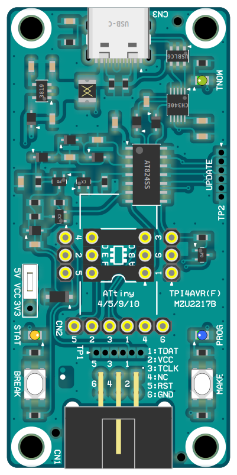

# Multix Zinnia "TPI4AVR" : TPI Programer Writer with High-Voltage Activation

> 写真は試作品

- TPI対応プログラマライター
  - 既発売中の __TPI方式 AVR全品種__ に対応。
    - ATtiny4/5/9/10 系統
    - ATtiny20/40 系統
    - ATtiny102/104 系統
- 基板サイズは 66x32mm
  - FRiSKケースにちょうど入るサイズ。
  - 4隅に M3マウントホール4個。TAMIYA ユニバーサルプレート適合ピッチ。
- WCH CH340E + USB(2.0) Type-C で PCと接続
- ATtiny824 採用
- JTAG2UPDI 上位互換
  - JTAGmkII over UART 方式
    - *avrdude* 6.8/7.0
    - 標準の *avrudude.conf* はそのままでは使えない（他のライタと排他非互換）
  - フラッシュメモリ 消去/書換
  - FUSE 書換
  - LOCKBIT 書換（デバイス施錠）
  - チップ消去 / デバイス施錠解除

- __HV（高電圧）書込モード対応__
  - PWM出力2本による 3段チャージポンプで適宜高電圧発生。
  - 有効時は 12Vレベルを書換動作中維持。
    - *avrdude* の `-e -F -U` 三つ組オプションが HV許可スイッチになる。
- 5種類の 接続コネクタ
  - MIL/6P ICSP互換コネクタ（ATMEL-ICE互換）
  - SIP/6P バラ線コネクタ（523146配列）※PICkit3/4配列ではない
    - 旧世代AVR の ATtiny13/85等に由来する直列型ピン配置で、変換ケーブルを共用できる
  - ハーフピッチ/6P コンスルー用コネクタ（配列は同上）
  - DIP/6P 600MIL 幅 ATtiny10 配列
  - DIP/6P 300MIL 幅 ATtiny10 配列
    - SOT-23 変換ソケットや、300/600MIL 変換ソケットを直差し可能
    - PB1端子でユーザー制御可能な LED付（LED_BUILTIN）

- `BREAK`ボタン
  - ICSP 5番（RESET）を LOW に引く
- `MAKE`ボタン
  - TPI経由で ターゲットMCUをリセット＆TPI通信テスト
- 3個の LEDインジケーター
  - `GREEN`（TNOW）PC との JTAG-TX通信
  - `ORANGE`（STAT）TPI通信中 TCLK表示 -- PB1端子でユーザー制御可能（LED_BUILTIN）
  - `BLUE`（PROG）JTAG状態表示
- ジャンパープラグ
  - 供給電圧 3.3V / 5V / 供給なし（受電モード）を選択切替

## 設計情報

### 端子配列

#### CN1 : ICSP ターゲット用 MIL/6P ボックスヘッダ

> TDAT -- TPI DATA\
> TCLK -- TPI CLK

|基板内側|▼||基板端側|
|-|-|-|-|
|TDAT|1|2|VCC|1.8V-5.5V
|TCLK|3|4|NC|
|RST|5|6|GND|

#### CN2 : ICSP ターゲット用 SIP/6P 単列ソケット

#### TP1 : ICSP ターゲット用 ハーフピッチSIP/6P スルーホール端子

> 523146配列

|▼|信号名|
|-|-|
|1|5:RST
|2|2:VCC
|3|3:TCLK
|4|1:TDAT
|5|4:NC
|6|6:GND

#### 300MIL DIP/6P

#### 600MIL DIP/6P

||||||||
|-|-|-|-|-|-|-|
|4|PB2|4|3|PB1:TCLK|3|ORANGE LED
|2|VCC|5|2|GND|6
|5|PB3:RST|6|1|PB0:TDAT|1
||||▲|||

> ATtiny10 端子配列\
> 下記実装図向きに合わせてここでは上下逆に表記

- TPI制御時以外は、PB1 で LED制御可能（LED_BUILTIN）

#### TP2 : ファームウェアアップデート用 ハーフピッチSIP/6P スルーホール端子

> 523146配列

|▼|信号名|
|-|-|
|1|5:RST
|2|2:VCC
|3|3:HTCR (of Client)
|4|1:UPDI
|5|4:HRCT (of Client)
|6|6:GND

> HTCR -- Host TxD to Client RxD UART\
> HRCT -- Host RxD from Client TxD UART

#### JP1 : IOREF 動作電圧切替ジャンパー

|▼|信号名|
|-|-|
|1|5V
|2|VCC IOREF
|3|3.3V

### 部品実装イメージ

### レイヤー構成

> 色付レイヤーをクリックするとそのレイヤーが非表示になる。黒地をクリックすると初期状態に戻る。

- 両面2層
  - `黃` 表シルク
  - `濃紫` 表レジスト
  - `赤` 表銅箔
  - `灰` ドリル（両面銅箔有はスルーホール、ナシはノンスルーホール）
  - `青` 裏銅箔
  - `濃緑` 裏レジスト
  - `明紫` 裏シルク

[その他図面等はこのフォルダ](https://github.com/askn37/askn37.github.io/tree/main/product/TPI4AVR/2222_Zinnia-TPI4AVRF-MZU2217B/)

### ファームウェア / アップデート

ファームウェアのアップデートは、本体以外に別の UPDIプログラマライターが必要。（設計上の制約）

- [TPI4AVR(Rev.1)](https://github.com/askn37/TPI4AVR)
  - [SpenceKonde / megaTinyCore](https://github.com/SpenceKonde/megaTinyCore) で使用可能。
- [Multix Zinnia Product SDK [megaAVR] for Arduino IDE](https://github.com/askn37/multix-zinnia-sdk-modernAVR)
  - サンプルライブラリ/スケッチ として同梱。

## 開発の経緯

- __[Multix Zinnia “UPDI Reset Plus” Snap-On Circuit](../URP) で必要になったから作った__
  - 手段と目的が逆。
- __reduceAVR SDK を開発__
  - Arduino IDEのアップデート過程でAVRrc等の対応部分同梱がなくなっていた。（いつの間に？）
  - そもそも AVR Dx 対応のために AVR-GCC/AVR-LIBC 差し替え自体が必須だったので、まとめて対応することにした。
- __TPIプログラマライターがない__
  - 結構古い販売終了品を使うか、PICkit3/4 のファームウェアを書き換えるしか普通はできないようだ。
  - そもそも PICkit を使える人なら公式IDEを使いこなせるだろうし、Arduino IDE は使わないだろう。
  - だがそれは __オープンソースソフトウェア／オープンソースハードウェアの敗北__ なんだよ（＾＾；
  - プロプライエタリ環境と縁を切るなら、オープンソースハードウェアのプログラマライターを作らにゃあかん。
- __UPDI4AVR の設計を流用して TPI4AVRを作る__
  - TPI は PDI の制御線を1本減らしたもの。。。と思いきやさにあらず。
  - 実は UPDI と TPI は電気仕様がよく似ている。USART 視点では非同期式か、同期式かの違いでしかない。
  - つまり __単線同期式 RS485 から差動回路部分を取っ払った__ それそのもの。
  - なのでそれに対応している tinyAVR / megaAVR の USART を使うと
    IOレジスタ設定するだけで簡単に通信できてしまう。
    - 旧世代AVRはそういう用途に対応していないから、過去みんな苦労して実装してたわけですな。
  - 困ったのは PC側との接続で、旧式な JTAG to PDI 実装に新規対応するのは手間を食いすぎる。
  - そこで逆に、既にもう出来上がっている JTAGmkII to UPDI のほうを TPI 向けにできないか考えた。
  - これがアタリで *avrdude.conf* を1箇所修正すれば TPI書込可能になると判明。
    - 書換えずに済ませるには *avrdude* にパッチを当てなければならないが。
- __今後の課題__
  - UPDI4AVR の設計流用したせいでもあるが\
    ボタンと LED が実質役に立ってない。各1個（TEST & STAT）で十分ぽい。
  - Rev.1 は自分自身で自分のファームウェアを書き換えることが出来ない。
  - 冷静に考えてみたら（存外に気づくのが遅かった）そこくらいはジャンパーなり\
    2回路スライドスイッチなりで SerialUPDI に対応すれば第2書換器は不要じゃんよ？
  - 現状2組の UARTをもつ MCUでしか TPI4AVR ファームウェアを動かせない。

## 販売頒布予定

あることはあるが先立つもの次第。\
最終的に手半田作業が必要なのが MCUとソケット類だけになってるのは救い。

## Copyright and Contact

Twitter: [@askn37](https://twitter.com/askn37) \
GitHub: [https://github.com/askn37/](https://github.com/askn37/) \
Product: [https://askn37.github.io/](https://askn37.github.io/)

Copyright (c) askn (K.Sato) multix.jp \
Released under the MIT license \
[https://opensource.org/licenses/mit-license.php](https://opensource.org/licenses/mit-license.php) \
[https://www.oshwa.org/](https://www.oshwa.org/)
