# [MULTIX UPDI4AVR Programmer] 使い方の手引き

## PCとの接続

UPDI4AVR と PCとの接続には別途 USB Type-C ケーブルが必要です。
USB-SERIAL変換には WCH-CH340E が使われています。
正常にPCから認識されると、USBシリアルポート（COM）として見えるようになります。

### Windows

8.x以降では Windows Update からドライバを導入できます。

### macOS

Catalina 以降では標準でドライバが用意されています。

### USB-SERIAL ドライバ

各OS用の最新ドライバは下記リンクから入手できます。

- [WCH沁恒微电子](https://www.wch.cn/download/CH341SER_EXE.html)
- [GitHub - WCHSoftGroup](https://github.com/WCHSoftGroup?tab=repositories)

## Arduino IDE

UPDI4AVR を使用するには、avrdude コマンド 6.8 以降（7.1 以降を推奨）が必要です。

UPDI4AVR は JTAG2UPDI 書込器上位互換であるため、
その代わりに使うことができます。

### Arduino API 互換開発環境

- [MCUdude / MegaCoreX](https://github.com/MCUdude/MegaCoreX) - megaAVR-0 Series
- [SpenceKonde / megaTinyCore](https://github.com/SpenceKonde/megaTinyCore/tree/master) - tinyAVR-0/1/2 Seriens
- [SpenceKonde / DxCore](https://github.com/SpenceKonde/DxCore) - AVR_DA/DB/DD/EA Series

> これらの環境では JTAG2UPDI 互換書込器として選択できますが、
HV制御は programmers.txt を直接修正しなければ、IDE操作的には許可されません。

> 非推奨: 注意深く運用するなら UPDI4VRハードウェアの JP1ジャンパーをショートしておき、
物理的に常時 HV制御有効とすることができます。

### AVR-GCC , AVR-LIBC , Micro_API , Bootloader

- [askn37 / multix-zinnia-sdk-megaAVR](https://github.com/askn37/multix-zinnia-sdk-megaAVR) - tinyAVR-0/1/2, megaAVR-0 Series
- [askn37 / multix-zinnia-sdk-modernAVR](https://github.com/askn37/multix-zinnia-sdk-modernAVR) - AVR_DA/DB/DD/EA Series

> これらは Arduino IDE で AVR-GCC / AVR-LIBC をネイキッドで使用するための SDKであり、
Arduino API 互換ではありません。

> avrdude 7.1 以降が付属し、UPDI4AVR に対応しており、
書込器選択で HV制御を有効化できます。

## 対象AVRデバイスとの接続

対象デバイスにMIL/6Pコネクタが用意されており、
かつピン配列が同じであれば、
CN1コネクタと IDC/6Pリボンケーブルで直接接続できます。

そうでなければ CN2コネクタにジャンパワイヤーを差し込み、
ブレッドボード等を介して接続してください。
少なくとも UPDI / VDD / GND の 3本は対象AVRデバイスと
"直結で" 配線する必要があります。

CN2コネクタのピン配列は、28端子以上の対象AVR（ATmega4808やAVR128DB28等）と順番が同じです。

- AVR_DD/EA系統で HV制御を行うには、PF6/RESET 端子の配線も必要です。
- 対象デバイスには電圧の安定した、十分な電力が供給されるようにしてください。
- 配線材は容量性負荷の低いものを選び、長さも 30cm を超えるべきではありません。
- 使用時は金属片等が本体に触れないようにしてください。（保護ケースの使用を推奨）
- CN1コネクタと CN2コネクタの使用は排他です。同時に複数のデバイスを接続・制御することはできません。

> UPDI端子（とRESET端子）に想定外の容量性負荷回路が接続されていると、
正しいUPDI制御が電気的に成り立ちません。
それらは全て事前に取り外すか、ジャンパーで対象AVRデバイスと切り離されている必要があります。

### UARTパススルー

UPDI制御とは別に、USBシリアルと 対象AVRデバイスの UARTとが接続できます。
Arduino IDE のシリアルモニターであれば、
UARTシリアルモニター通信と UPDI制御通信を、自動で切り替えることができます。

HTCR は "Host TxD to Client RxD" の略、
HRCT は "Host RxD from Client TxD" の略です。
対象AVRデバイスの UARTと、任意で配線してください。

> CN1コネクタと microUPDIコネクタ（tinyAVR / megaAVR 世代用）
とは仕様が異なるため、IDC/6Pリボンケーブルで接続する場合は
SW2 DIPスイッチの 3と 4をオフにしてください。
UARTパススルーは無効です。
デバイス側が microUPDIコネクタ仕様の場合 AVR_DD/EA/EBシリーズの HV制御はできません。

### SW1 ブレークボタン

SW1ブレークボタンは、正しく配線されているならば
対象AVRデバイスに対するリセットボタンとして機能します。
押している間はリセット状態が維持されます。

> RESET端子が未設定の tinyAVR シリーズは、UPDI制御でリセットされます。

SW1 は avrdude との接続操作中は、通信ブレーク（中断）ボタンとして機能します。

（UPDI制御ではなく）Bootloaderと UARTパススルーで読み書きする場合、
avrdude は RTS信号をトリガーとして対象AVRデバイスをリセットし、
Bootloader 動作を開始させます。
これは SW1ブレークボタンを押すのと同じ効果を持ちます。

### SW2 4連DIPスイッチ

1. UPDI4AVR から対象AVRデバイスに電力供給する場合の電圧を、3.3Vか 5Vから選択できます。
2. UPDI4AVR から対象AVRデバイスに電力を給電（VDD）するか、逆に受電（VTG）するかを選択できます。
3. HTCR信号を無効にできます。UARTパススルーは無効になります。
4. HRCT信号を無効にできます。UARTパススルーは無効になります。

> VDD給電可能電力は最大 5Vまたは 3.3Vで、100mA です。
VTG受電時は 1.8V〜5.6V を受け入れますが、
メモリ書き換え動作時は 3.0V未満になってはなりません。
USB-SERIAL変換を正しく動作させるには 3.1V未満になってはなりません。

> AVR_DA/DB/DDシリーズで供給電圧が4.25V未満の場合、メモリ読み書き速度が低下します。

## LED表示

### 緑LED

待機中はホタル明滅（ハートビート）します。
SW1ブレークボタンを押している間は、ブリンク点滅します。
PC側から UARTの RTS信号がブレーク（論理LOW）にされているならば、
フラッシュ発光します。

### 橙LED

UPDI / HTCR / HRCT 信号の何れかが 通信アクティブ（論理LOW）であるなら点灯します。

## HV制御

tinyAVR シリーズと、AVR_DD/EA シリーズに対しては
UPDI端子の制御機能を FUSE 変更するための HV制御が可能です。

- HV制御を始める前には、対象AVRデバイス・書込装置共、電源をいちどオフにすべきです。
- tinyAVR シリーズでは、PA0/UPDI 端子に対して 12V の高電圧パルスを供給します。
- AVR_DD/EA シリーズでは、PF6/RESET 端子に対して 8.2V の高電圧パルスを供給します。
tinyAVR シリーズの HV制御とは互いに物理的／電気的互換性はありません。
- megaAVR シリーズと、AVR_DA/DB シリーズは UPDI端子が専用（変更不可）のため、
HV制御はありません。

### JP1ジャンパーショート

通常、HV制御を使用するにはフェイルセーフのため avrdude コマンドに対して
`-U -F -e` の3つ組オプションを指定しなければなりません。
`-e` 指定によるデバイス全消去初期化を避けたい場合は、
JP1ジャンパーを短絡状態にしておくことで、
`-e` 指定がなくとも HV制御を自動機能させることができます。
これは対話ターミナルモードで特に有用です。

> UPDI制御が普通にできる限り、HV制御は不要のため能動的には発生しません。

ただし `-p` 指定が間違っていても指示された通りの対象AVRデバイスと見做して
強制的に制御が進んでしまうため、誤った `-p` 指定は不可逆的な故障を招く場合があります。

- JP1ジャンパーは保護ケース内に隠れています。変更する場合はケースから取り出してください。
- 基板単体販売では JP1ジャンパープラグは付属しません。
別途用意するか、ジャンパーピンを半田付けしてください。

## UPDI4AVR のファームウェア更新

UPDI4AVR のファームウェアは下記リンクの開発環境を Arduino IDE に導入することで入手できます。

- [askn37 / multix-zinnia-updi4avr-firmware-builder](https://github.com/askn37/multix-zinnia-updi4avr-firmware-builder) - for UPDI4AVR Firmware

### SW3 ファームウェア更新スイッチ

ファームウェア更新の際は SW3スイッチを "FW" にスライドし、
Arduino IDE 書込器選択は "SerialUPDI" を選んでください。
ファームウェア更新後は SW3スイッチを "RUN" に戻してください。

- SW3は保護ケース内に隠れています。変更する場合はケースから取り出してください。
- ファームウェアを書き換えても UPDI4AVR 固有のシリアル番号は不変です。

### TP1メンテナンスポート

FUSE書き換え不良等により前述の方法でファームウェアを更新できなくなった場合は、
第二の UPDI4AVR を別途用意して TP1メンテナンスポートに配線し、
SW3は "RUN" 側とし、
HV制御を有効にして書き換えてください。

> "SerialUPDI" 書込器選択での HV制御はできません。
> TP1から FW更新する場合は、SW3を "RUN" 側にしていなければなりません。

- TP1は保護ケース内に隠れています。使用する場合はケースから取り出してください。
- TP1は 1.27mmハーフピッチのため通常の配線は難しいでしょう。
別売の変換アダプタ（ハーフピッチコンスルー端子）を利用するか、半田付けを伴う配線が必要です。

## Copyright and Contact

Twitter: [@askn37](https://twitter.com/askn37) \
GitHub: [https://github.com/askn37/](https://github.com/askn37/) \
Product: [https://askn37.github.io/](https://askn37.github.io/)

Copyright (c) askn (K.Sato) multix.jp \
Released under the MIT license \
[https://opensource.org/licenses/mit-license.php](https://opensource.org/licenses/mit-license.php) \
[https://www.oshwa.org/](https://www.oshwa.org/)
