# [MULTIX UPDI4AVR Programmer] Instructions for use

Switch Language [(en-US)](1_Usage_en.html) [(ja-JP)](1_Usage.html)

## Connection with PC

A separate USB Type-C cable is required to connect UPDI4AVR to a PC.
WCH-CH340E is used for USB-SERIAL conversion.
If it is successfully recognized by the PC, it will be visible as a USB serial port (COM).

### Windows

For versions 8.x and later, drivers can be installed from Windows Update.

### macOS

Drivers are provided as standard in Catalina and later versions.

### USB-SERIAL driver

The latest drivers for each OS can be obtained from the links below.

- [WCH Qinheng Microelectronic](https://www.wch.cn/download/CH341SER_EXE.html)
- [GitHub - WCHSoftGroup](https://github.com/WCHSoftGroup?tab=repositories)

## Arduino IDE

UPDI4AVR requires the avrdude command 6.8 or later (7.1 or later recommended).

UPDI4AVR is upward compatible with JTAG2UPDI writer, so
You can use it instead.

### Arduino API compatible development environment

- [MCUdude / MegaCoreX](https://github.com/MCUdude/MegaCoreX) - megaAVR-0 Series
- [SpenceKonde / megaTinyCore](https://github.com/SpenceKonde/megaTinyCore/tree/master) - tinyAVR-0/1/2 Seriens
- [SpenceKonde / DxCore](https://github.com/SpenceKonde/DxCore) - AVR_DA/DB/DD/EA Series

> In these environments, it can be selected as a JTAG2UPDI compatible writer, but
HV control is not allowed operationally in the IDE without directly modifying programmers.txt.

>Not recommended: For careful operation, short his JP1 jumper on the UPDI4VR hardware,
HV control can be physically enabled at all times.

### AVR-GCC , AVR-LIBC , Micro_API , Bootloader

- [askn37/multix-zinnia-sdk-megaAVR](https://github.com/askn37/multix-zinnia-sdk-megaAVR) - tinyAVR-0/1/2, megaAVR-0 Series
- [askn37/multix-zinnia-sdk-modernAVR](https://github.com/askn37/multix-zinnia-sdk-modernAVR) - AVR_DA/DB/DD/EA Series

> These are SDKs for using AVR-GCC / AVR-LIBC naked with Arduino IDE,
Not Arduino API compatible.

> Comes with avrdude 7.1 or later, supports UPDI4AVR,
HV control can be enabled by selecting the writer.

## Connect with target AVR device

The target device has a MIL/6P connector,
And if the pin arrangement is the same,
Can be connected directly with CN1 connector and IDC/6P ribbon cable.

If not, insert a jumper wire into the CN2 connector,
Please connect via breadboard etc.
At least three of UPDI / VDD / GND are connected to the target AVR device.
Must be wired "directly".

The pin arrangement of the CN2 connector is in the same order as the target AVR with 28 or more pins (ATmega4808, AVR128DB28, etc.).

- To perform HV control in the AVR_DD/EA system, wiring for the PF6/RESET terminal is also required.
- Ensure that the target device has sufficient power with stable voltage.
- The wiring material should have a low capacitive load, and the length should not exceed 30cm.
- When using the product, make sure that metal pieces do not touch the product. (Use of protective case recommended)
- The use of CN1 connector and CN2 connector is exclusive. It is not possible to connect and control multiple devices at the same time.

> If an unexpected capacitive load circuit is connected to the UPDI terminal (and RESET terminal),
Correct UPDI control is not possible electrically.
All of them must be removed or jumpered to the target AVR device.

### UART passthrough

Apart from UPDI control, USB serial and UART of the target AVR device can be connected.
If it is a serial monitor of Arduino IDE,
You can automatically switch between UART serial monitor communication and UPDI control communication.

HTCR stands for "Host TxD to Client RxD"
HRCT stands for "Host RxD from Client TxD".
Wire with the UART of the target AVR device as desired.

> CN1 connector and microUPDI connector (for tinyAVR / megaAVR generation)
Since the specifications are different from the
Turn off SW2 DIP switches 3 and 4.
UART passthrough is disabled.
If the device side is microUPDI connector specification, AVR_DD/EA/EB series HV control is not possible.

### SW1 Break button

If the SW1 break button is wired correctly
Acts as a reset button for the target AVR device.
The reset state is maintained as long as it is pressed.

> tinyAVR series whose RESET terminal is not set will be reset by UPDI control.

SW1 functions as a communication break (interrupt) button during connection operation with avrdude.

When reading and writing with Bootloader and UART passthrough (rather than UPDI control),
avrdude uses the RTS signal as a trigger to reset the target AVR device,
Start Bootloader operation.
This has the same effect as pressing the SW1 break button.

### SW2 4-way DIP switch

1. You can select the voltage when supplying power from UPDI4AVR to the target AVR device from 3.3V or 5V.
2. You can select whether to supply power (VDD) or receive power (VTG) from UPDI4AVR to the target AVR device.
3. You can disable HTCR signals. UART passthrough is disabled.
4. HRCT signal can be disabled. UART passthrough is disabled.

> The maximum VDD power supply is 5V or 3.3V and 100mA.
When receiving VTG power, it accepts 1.8V to 5.6V, but
It must not fall below 3.0V during memory rewrite operation.
For USB-SERIAL conversion to work properly, it must not go below 3.1V.

> If the supply voltage is less than 4.25V for AVR_DA/DB/DD series, the memory read/write speed will be reduced.

## LED display

### Green LED

The firefly blinks (heartbeat) while it is on standby.
It blinks while the SW1 break button is pressed.
If the UART RTS signal is set to break (logic LOW) from the PC side,
Fires a flash.

### Orange LED

Lights up if any of the UPDI / HTCR / HRCT signals are communication active (logic LOW).

## HV control

For tinyAVR series and AVR_DD/EA series
HV control is possible to change the control function of the UPDI terminal with FUSE.

- Before starting HV control, both the target AVR device and writing device should be powered off.
- The tinyAVR series supplies a 12V high voltage pulse to the PA0/UPDI terminal.
- AVR_DD/EA series supplies 8.2V high voltage pulse to PF6/RESET pin.
There is no physical/electrical compatibility with the tinyAVR series HV control.
- Since the megaAVR series and AVR_DA/DB series have a dedicated UPDI terminal (cannot be changed),
There is no HV control.

### JP1 jumper short

Normally, to use HV control, for fail-safe purposes, the avrdude command is
The `-U -F -e` triplet option must be specified.
If you want to avoid initializing the device by specifying `-e`,
By keeping the JP1 jumper shorted,
HV control can function automatically even without the `-e` specification.
This is especially useful in interactive terminal mode.

> As long as UPDI control can be performed normally, HV control is unnecessary and will not occur actively.

However, even if the `-p` specification is incorrect, it will be treated as the target AVR device as specified.
Incorrect `-p` specification may lead to irreversible failure, as control will proceed forcibly.

- JP1 jumper is hidden inside the protective case. If you wish to change it, please remove it from the case.
- The JP1 jumper plug is not included when the board is sold separately.
Please prepare separately or solder the jumper pin.

## Firmware update for UPDI4AVR

The UPDI4AVR firmware can be obtained by installing the development environment linked below into Arduino IDE.

- [askn37/multix-zinnia-updi4avr-firmware-builder](https://github.com/askn37/multix-zinnia-updi4avr-firmware-builder) - for UPDI4AVR Firmware

### SW3 Firmware Update Switch

When updating the firmware, slide the SW3 switch to "FW",
Please select "SerialUPDI" for Arduino IDE programming device selection.
After updating the firmware, return the SW3 switch to "RUN".

- SW3 is hidden inside a protective case. If you wish to change it, please remove it from the case.
- Even if the firmware is rewritten, the serial number unique to UPDI4AVR remains unchanged.

### TP1 Maintenance Port

If the firmware cannot be updated using the method described above due to a faulty FUSE rewrite, etc.,
Prepare a second UPDI4AVR separately and wire it to the TP1 maintenance port.
SW3 is set to "RUN" side,
Please enable HV control and rewrite.

> HV control cannot be performed by selecting the "SerialUPDI" writer.
> When updating the FW from TP1, SW3 must be set to the "RUN" side.

- TP1 is hidden inside a protective case. Please remove it from the case when using it.
- TP1 has a 1.27mm half pitch, so normal wiring will be difficult.
It is necessary to use a conversion adapter (half-pitch con-through terminal) sold separately, or to perform wiring that involves soldering.

## Copyright and Contact

Twitter: [@askn37](https://twitter.com/askn37) \
GitHub: [https://github.com/askn37/](https://github.com/askn37/) \
Product: [https://askn37.github.io/](https://askn37.github.io/)

Copyright (c) askn (K.Sato) multix.jp \
Released under the MIT license
[https://opensource.org/licenses/mit-license.php](https://opensource.org/licenses/mit-license.php) \
[https://www.oshwa.org/](https://www.oshwa.org/)
