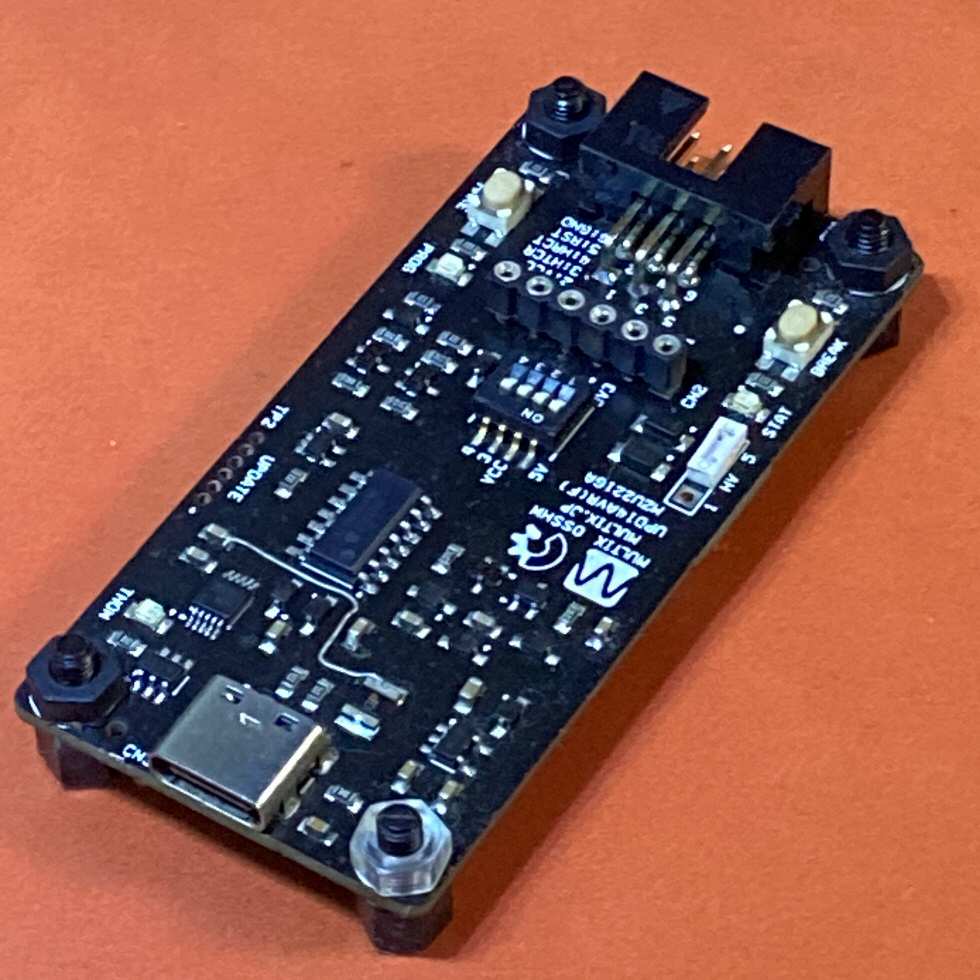
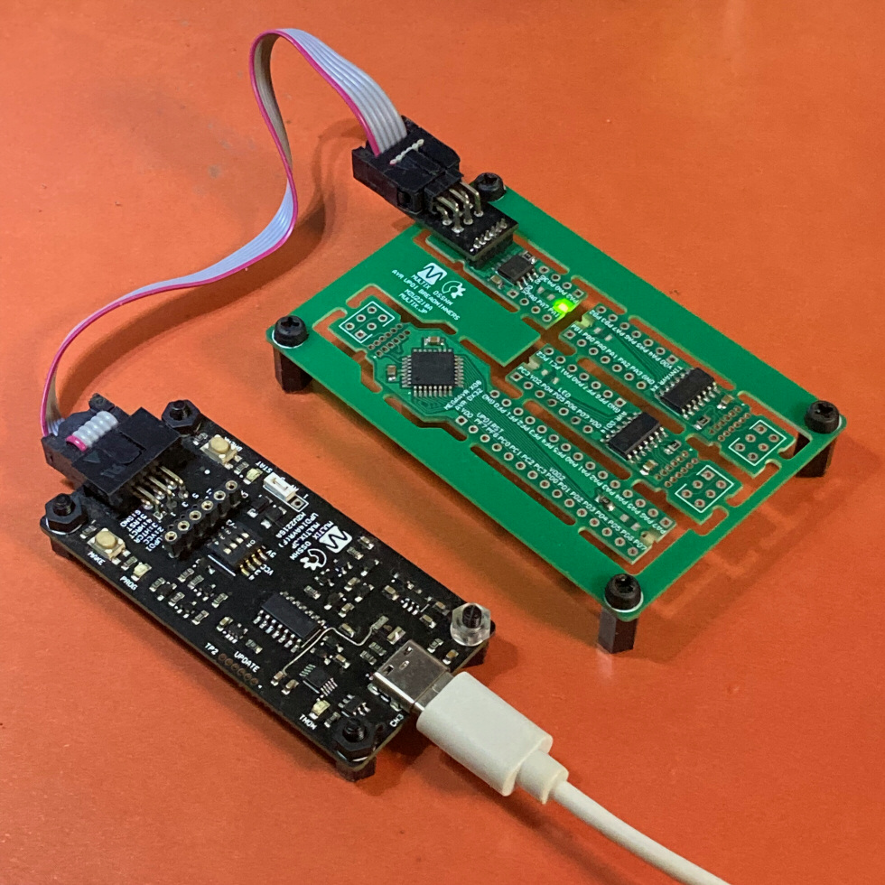
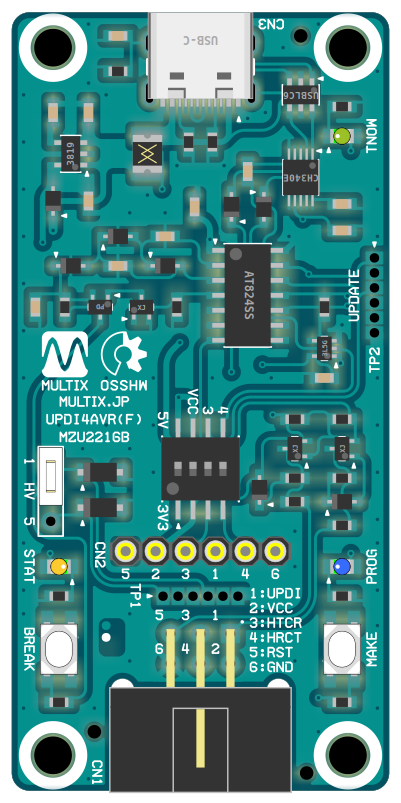
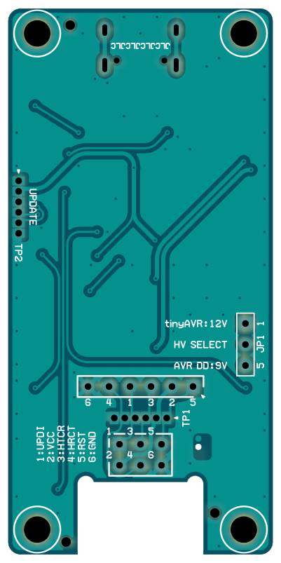
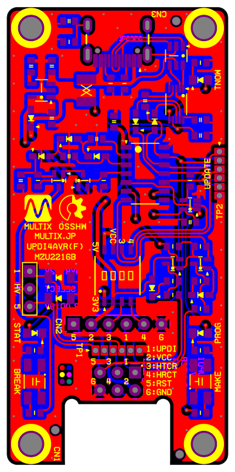

# Multix Zinnia "UPDI4AVR" : UPDI Programer Writer with High-Voltage Activation

> 写真は試作品

- UPDI対応プログラマライター
  - 既発売中の __UPDI方式 AVR全品種__ に対応。
    - megaAVR-0 系統
    - tinyAVR-0/1/2 系統
    - AVR DA/DB/DD 系統
- 基板サイズは 66x32mm
  - FRiSKケースにちょうど入るサイズ。
  - 4隅に M3マウントホール4個。TAMIYA ユニバーサルプレート適合ピッチ。
- *avrdude* 6.8/7.0対応
  - 7.0 ならば 1.5Mbps 高速転送可能
- WCH CH340E + USB(2.0) Type-C で PCと接続
- ATtiny824 採用
- JTAG2UPDI 上位互換
  - JTAGmkII over UART 方式
  - フラッシュメモリ 消去/書換
  - EEPROM 消去/書換
  - FUSE 書換
  - USERROW（ユーザーシグネチャ領域）消去/書換
  - LOCKBIT 書換（デバイス施錠）
  - チップ消去 / デバイス施錠解除
- __HV（高電圧）書込モード対応__
  - PWM出力2本による 3段チャージポンプで適宜高電圧発生。
  - 12Vパルスを UPDIパッドに印加するタイプの tinyAVR-0/1/2 系統
  - 9Vパルスを RESETパッドに印加するタイプの AVR DD 系統
    - *avrdude* の `-e -F -U` 三つ組オプションが HV許可スイッチになる。

- 3種類の 接続コネクタ
  - MIL/6P ICSP互換コネクタ（ATMEL-ICE互換）
  - SIP/6P バラ線コネクタ（523146配列）※PICkit3/4配列ではない
    - 旧世代AVR の ATtiny13/85等に由来する直列型ピン配置で、変換ケーブルを共用できる。
  - ハーフピッチ/6P コンスルー用コネクタ（配列は同上）
- UART パススルー対応
  - mEDBG / microUPDI 同様に、UPDI書換時以外は ターゲットMCU の UART と PC とを自動仲介。
  - 最高 3Mbps
- `BREAK`ボタン
  - ICSP 5番（RESET）を LOW に引く。
- `MAKE`ボタン
  - UPDI経由で ターゲットMCUをリセット＆UPDI通信可能表示。
- 3個の LEDインジケーター
  - `GREEN` PC との TX通信（TNOW）
  - `ORANGE` UPDI通信中 XDIR表示
  - `BLUE` JTAG通信表示
- ジャンパープラグ
  - 9Vモード兼 RESET（BREAK）ボタン有効化モード
  - 12Vモード
- ミニDIP/4Pスイッチ
  - ターゲットMCUへの 3.3V / 5V / 電源供給なし（受電モード）を切替。
  - ターゲットMCUとの UART TxD/RxD を接続・切断切替。

## 設計情報

### 端子配列

> HTCR -- Host TxD to Client RxD UART\
> HRCT -- Host RxD from Client TxD UART

#### CN1 : ICSP ターゲット用 MIL/6P ボックスヘッダ

|上段|▼||下段|
|-|-|-|-|
|UPDI|1|2|VCC
|HTCR|3|4|HRCT
|RST|5|6|GND

#### CN2 : ICSP ターゲット用 SIP/6P 単列ソケット

#### TP1 : ICSP ターゲット用 ハーフピッチSIP/6P スルーホール端子

> 523146配列

|▼|信号名|
|-|-|
|1|5:RST
|2|2:VCC
|3|3:HTCR (of Host)
|4|1:UPDI
|5|4:HRCT (of Host)
|6|6:GND

#### TP2 : ファームウェアアップデート用 ハーフピッチSIP/6P スルーホール端子

> 523146配列

|▼|信号名|
|-|-|
|1|5:RST
|2|2:VCC
|3|3:HTCR (of Client)
|4|1:UPDI
|5|4:HRCT (of Client)
|6|6:GND

#### JP1 : HVモード切替ジャンパー

|▼|信号名|
|-|-|
|1|tyinyAVR用 12V
|2|HVパルス供給
|3|AVR DD用 9V

#### DIP/4P

|▼|ON|OFF|
|-|-|-|
|1|5V|3.3V
|2|給電|受電
|3|HRCT有効|切断
|4|HTCR有効|切断

### 部品実装イメージ

### レイヤー構成

> 色付レイヤーをクリックするとそのレイヤーが非表示になる。黒地をクリックすると初期状態に戻る。

- 両面2層
  - `黃` 表シルク
  - `濃紫` 表レジスト
  - `赤` 表銅箔
  - `灰` ドリル（両面銅箔有はスルーホール、ナシはノンスルーホール）
  - `青` 裏銅箔
  - `濃緑` 裏レジスト
  - `明紫` 裏シルク

[その他図面等はこのフォルダ](https://github.com/askn37/askn37.github.io/tree/main/product/UPDI4AVR/2221_Zinnia-UPDI4AVRF-MZU2216B)

### ファームウェア / アップデート

ファームウェアのアップデートは、本体以外に別の UPDIプログラマライターが必要。（設計上の制約）

- [UPDI4AVR(Rev.1)](https://github.com/askn37/UPDI4AVR)
  - [SpenceKonde / megaTinyCore](https://github.com/SpenceKonde/megaTinyCore) で使用可能。
- [Multix Zinnia Product SDK [megaAVR] for Arduino IDE](https://github.com/askn37/multix-zinnia-sdk-modernAVR)
  - サンプルライブラリ/スケッチ として同梱。

## 開発の経緯

- __昔は特に困ってなかった__
  - これを作ろうと思う以前は、普通に mEDBG / microUPDI を使っていた。
  - 書込が遅かったり HV書込も出来なかったが、特に不満もなかった。UARTパススルー便利だし。
  - ところが出来心で AVR128DB32 を入手したら状況一変。__UPDIバージョンが違って全く書けない！__
  - pyupdi（当時）は python バージョン違いで環境依存性が強く、なかなかうまく動かない。
    SerialUPDI の存在はまだ知らなかった。
  - *avrdude* のソース等を参考に（この頃7.0では SerialUPDI 対応が始まっていた）\
    [UPDIUart](https://github.com/askn37/UPDIUart) を自作して
    なんとかブートローダー書込だけは可能になり、詰み状態からは脱したものの。。。
  - 不便の一言。UARTパススルーの出来ない時代に戻りたくないってば。（SerialUPDI もそれ出来ないし）
  - しばらくは *Curiosity Nano* を買って御茶を濁してたが、結局挑んでみることにした。
  - バラで買った AVR DA/DB が活かせないとか、動作電圧切替も簡単じゃないとかもあった。
- __UPDI4AVR（ファームウェア）__ の初版は __あっさり書けた。__
  - 実は UPDI と TPI は電気仕様がよく似ている。USART 視点では非同期式か、同期式かの違いでしかない。
  - つまり UPDI は __単線非同期式 RS485 から差動回路部分を取っ払った__ それそのもの。
  - なのでそれに対応している tinyAVR / megaAVR の USART を使うと
    IOレジスタ設定するだけで簡単に通信できてしまう。
    - 旧世代AVRはそういう用途に対応していないから、過去みんな苦労して実装してたわけですな。
  - 最初は *Arduino UNO WiFi Rev.2* に拡張シールドを載せる形式を志向。
  - けどコレ国内入手性が低いので、やっぱり自分専用状態に違いない。
  - それで *Arduino Nano Every* ベースを考えてみるが。。。これのオンボード書込器がすごく変。
  - 調べてみると JTAG2UPDI 互換と見せかけて 1200bps制御が必要とか、__誰だこれ考えた/採用したヤツ（怒）__
  - しょうがねえ、*avrdude* からちゃんと使えるプログラマライタ作ってやんよ。
  - 当然 HV対応で、新発売の AVR DD も使えるようにしてやる。そうでなきゃスクラッチの意味がない。
- __UPDI4AVR（ハードウェア）誕生__
  - 試作機が出来上がるまで一ヶ月そこそこだったろう。
  - 案外 JLC 発送待ちのほうが長かったくらいで、いくらも手間暇は掛けていない。
  - しかしここから遠回りが始まる。*SpenceKonde*（*Dr.Azzy*）氏の作ってる\
    __DxCore__ や __megaTinyCore__ がどうにも肌に合わなかったのだ。
  - 使えば使うほどストレスが溜まる。特にボードメニュー。
  - __AVRチップコレクター__ でもある自分からしたら様々な理由で使いにくいこと極まり、ミスオペも増える。
  - __"Duino"__ 開発も一段落したところで、自作SDK整備に着手。\
    当初から Arduino API互換は放棄してインラインアセンブリも辞さないピーキーな方向性を志向。
  - そこから半年、__ハードもソフトもプログラマライタも全部自作スクラッチ__ で全部通した\
    __modernAVR__ 開発環境がひととおり揃うことになってしまった。
  - 途中寄り道して ATTiny10 向けの環境整備と [__TPI4AVR__](../TPI4AVR/) も作ってしまったが。
- __今後の課題__
  - ボタンと LED が大して役に立ってない。各1個（TEST & STAT）で十分ぽい。
  - Rev.1 は自分自身で自分のファームウェアを書き換えることが出来ない。
  - 冷静に考えてみたら（存外に気づくのが遅かった）そこくらいはジャンパーなり\
    2回路スライドスイッチなりで SerialUPDI に対応すれば第2書換器は不要じゃんよ？
  - 現状2組の UARTをもつ MCUでしか UPDI4AVR ファームウェアを動かせない。
  - だから少ピン品種では tinyAVR-2 しか選択肢がないのが狭い。
  - AVR_DD14（SOIC）も少し特殊で容易に移植できない。
  - だがそれを評価しているうちに気づいたのだが、\
    PORTMUX や CCL/LUT を駆使すれば 1組の UARTで済む気がするのだ。
  - そうすれば ATtiny1616（VQFN）が選べるようになり、しかもこの極小 3mm角チップは\
    JLC に部品在庫が十分あるので製造コストが下げられる、筈。。。（沼は続く）

## 販売頒布予定

あることはあるが先立つもの次第。\
最終的に手半田作業が必要なのが MCUとソケット類だけになってるのは救い。

## Copyright and Contact

Twitter: [@askn37](https://twitter.com/askn37) \
GitHub: [https://github.com/askn37/](https://github.com/askn37/) \
Product: [https://askn37.github.io/](https://askn37.github.io/)

Copyright (c) askn (K.Sato) multix.jp \
Released under the MIT license \
[https://opensource.org/licenses/mit-license.php](https://opensource.org/licenses/mit-license.php) \
[https://www.oshwa.org/](https://www.oshwa.org/)
