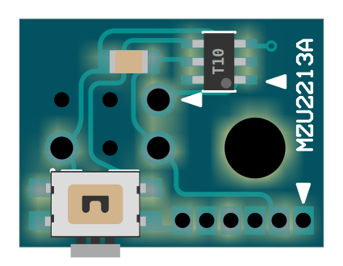

# Multix Zinnia “UPDI Reset Plus” Snap-On Circuit

> 写真は試作品

- UPDI経由リセット機能追加アダプタ
  - ハードウェア専用RESET端子が UPDI端子と共用の tinyAVR-0/1/2 を、
    FUSE書換せずとも簡単にリセット可能にするスナップオン基板
  - UARTブートローダーを電源オフ/オンせずに、ワンアクションで起動させられる
  - 他の UPDI対応 AVR にも使用可能
- 基板サイズは 16x12mm
- ATtiny10 採用

- MIL/6P ICSP ピンヘッダに直差装着
  - MAC-8 ソケット君 3個採用 -- UPDI / VCC / GND
  - ピン長が十分なら、ジャンパーワイヤ（メス）と併接可能
  - M3マウントホールで抜け止め固定可能（Arduino ICSP端子横の M3マウントホールと同寸法位置）
- 横方向タクトスイッチ 1個
  - 押して離すと ターゲットMCU を RESET
  - 押し続けているあいだ RESET 状態を維持、離すと開放

## 設計情報

### 端子配列

#### ICSP ターゲット用 MIL/6P スルーホールソケット

|基板内側||▼|||基板端側|
|-|-|-|-|-|-|
|制御信号|UPDI|1|2|VCC|1.8V-5.5V|
||NC|3|4|NC||
||NC|5|6|GND|信号接地|

#### ファームウェアアップデート用 ハーフピッチSIP/6P

> 523146配列

|▼|信号名||
|-|-|-|
|1|5:RST
|2|2:VCC
|3|3:TCLK
|4|1:TDAT|兼UPDI送信
|5|4:NC
|6|6:GND

### 部品実装イメージ

### レイヤー構成

> 色付レイヤーをクリックするとそのレイヤーが非表示になる。黒地をクリックすると初期状態に戻る。

- 両面2層
  - `黃` 表シルク
  - `濃紫` 表レジスト
  - `赤` 表銅箔
  - `灰` ドリル（両面銅箔有はスルーホール、ナシはノンスルーホール）
  - `青` 裏銅箔
  - `濃緑` 裏レジスト
  - `明紫` 裏シルク

[その他図面等はこのフォルダ](https://github.com/askn37/askn37.github.io/tree/main/product/URP/2213_Zinnia-URP-MZU2213A/)

### ファームウェア / アップデート

ファームウェアのアップデートは、本体と別に TPIプログラマライターが必要。（必須）

- [Multix Zinnia "TPI4AVR"](../TPI4AVR) -- TPIプログラマライター
  - ハーフピッチSIP/6P と __コンスルーコネクタで直結して書換__
- [Multix Zinnia Product SDK [reduceAVR] for Arduino IDE](https://github.com/askn37/multix-zinnia-sdk-reduceAVR)
  - [サンプルライブラリ/スケッチ として同梱](https://github.com/askn37/multix-zinnia-sdk-reduceAVR/tree/main/libraries/reduceAVR/examples/Miscellaneous/UPDI_Reset_Plus)

## 開発の経緯

- __[Multix Zinnia "UPDI4AVR"](../UPDI4AVR) の開発過程で閃いた__
  - UPDI 経由なら、RESET端子のない tinyAVR-0/1/2 にも外部からリセットが掛けられる。
  - それで何が嬉しいかというと、UARTブートローダーを任意のタイミングで起動できる。
  - 従来は起動に電源断が必要で、UART初期化ラグを待つために8秒待機してたのが、なくせることになる。
  - この8秒というのは *acrdude* のリトライが 10秒間隔固定だからで、双方が合致する機会が少ないせい。
    - ブートローダーを tinyAVR に敢えて組み込む意義って何？という疑問もあるだろうが。。。
    - ブートローダー側に対応スニペットがあると、余っているフラッシュメモリ領域を自己書換するのが簡単になる。
    - なんならスケッチ領域自身を意図的に消去することもできる。（セキュリティ上の理由で）
    - それなしで自己書換可能するには書換許可領域を FUSE で設定しないといけない。
- __ICSPピンヘッダ直刺しはすぐに考えついたが__
  - ターゲットMCUより安価でもっと小さいチップでないと実装コストが価格も面積も逆転して本末転倒。
  - となるともう 6pin の ATtiny4/5/9/10 か、それと同種の 6pin PIC しか選択肢がない。
  - それらの Arduino IDE用SDKを探してみると・・・あるにはあるが動かない。
- __reduceAVR SDK を開発__
  - Arduino IDEのアップデート過程でAVRrc等の対応部分同梱がなくなっていた。（いつの間に？）
  - そもそも AVR Dx 対応のために AVR-GCC/AVR-LIBC 差し替え自体が必須だったので、まとめて対応することにした。
- __TPIプログラマライターがない__
  - 結構古い販売終了品を使うか、PICkit3/4 のファームウェアを書き換えるしか普通はできないようだ。
  - そもそも PICkit を使える人なら公式IDEを使いこなせるだろうし、Arduino IDE は使わないだろう。
  - だがそれは __オープンソースソフトウェア／オープンソースハードウェアの敗北__ なんだよ（＾＾；
  - プロプライエタリ環境と縁を切るなら、オープンソースハードウェアのプログラマライターを作らにゃあかん。
- __UPDI4AVR の設計を流用して TPI4AVRを作る__
  - TPI は PDI の制御線を1本減らしたもの。。。と思いきやさにあらず。
  - 実は UPDI と TPI は電気的仕様がよく似ている。USART 視点では非同期式か、同期式かの違いでしかない。
  - つまり __単線同期式 RS485 から差動回路部分を取っ払った__ それそのもの。
  - なのでそれに対応している tinyAVR の USART を使うと IOレジスタ設定するだけで簡単に通信できる。
    - 旧世代AVRはそういう用途に対応していないから、過去みんな苦労して実装してたわけですな。
  - 困ったのは PC側との接続で、旧式な JTAG to PDI 実装に新規対応するのは手間を食いすぎる。
  - そこで逆に、既にもう出来上がっている JTAGmkII to UPDI のほうを TPI 向けにできないか考えた。
  - これがアタリで *avrdude.conf* を1箇所修正すれば TPI書込可能になると判明。
    - 書換えずに済ませるには *avrdude* にパッチを当てなければならないが。
  - そんな遠回りをした後は簡単だった。
- __URP作成（本題）__
  - 設計は ATtiny10 にタクトスイッチ1個とパスコン、あとはスルーホールソケット実装のみ。
  - UPDI通信生成はビットパターンを GPIO にプッシュするだけ。
    - デバイスリセットコマンドを実行するだけなら受信不要なので送信専用。
    - コマンドはリセット実施/開放が個別なので、都合2回送る。
  - 送信速度はデバイスが許容する範疇であれば良いので、主制御クロック自体の変更で対応。
    - WDT用 128kHz 内蔵発振器を主クロックに選び、分周比で調整すると丁度よい。
  - 非活性時は全 GPIO を Hi-Z にし、休止状態にする。
    - タクトスイッチ操作で活性化。その HIGH/LOW 論理に応じてリセット実施/開放を決める仕組み。

## 販売頒布予定

あることはあるが先立つもの次第。\
基本的に手半田実装なので少数ロット。\
よほどの大量一括発注でもないと工場生産が使えず、あまり安くはならないよ。\
（でもそんな大口需要が見込めるモノでもない。玄人向けだわな＾＾）

## Copyright and Contact

Twitter: [@askn37](https://twitter.com/askn37) \
GitHub: [https://github.com/askn37/](https://github.com/askn37/) \
Product: [https://askn37.github.io/](https://askn37.github.io/)

Copyright (c) askn (K.Sato) multix.jp \
Released under the MIT license \
[https://opensource.org/licenses/mit-license.php](https://opensource.org/licenses/mit-license.php) \
[https://www.oshwa.org/](https://www.oshwa.org/)
