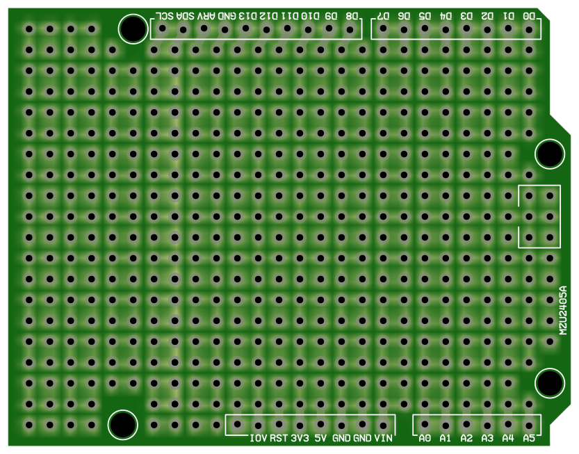

# OpenData

このページで公開しているデータは誰でも自由に使用／改変／再配布することができる。\
Anyone can freely use, modify, and redistribute the data published on this page.

## Arduino Universal Board

Arduino UNO Rev.3 規格の標準的なユニバーサル基板ガーバーデータ。
ダウンロードできる Zip ファイルは、JLCPCB、Erectrow、FusionPCB などで直ちに製造することができる。\
Standard universal board Gerber data for Arduino UNO Rev.3 standard.
Downloadable Zip files can be manufactured immediately with JLCPCB, Erectrow, FusionPCB, etc. \

> [!TIP]
> JLCPCBの場合、2ドルで5枚が製造でき、配送業者にOCS NEPを選択すると日本向けの送料は 0.98 ドルしか掛からない。つまり送料込み500円以下だろう。クレジットカードが使えるなら、国内のオンライン店舗より安上がりな場合が多い。\
> In the case of JLCPCB, 5 pieces can be manufactured for $2.0, and if OCS NEP is selected as the shipping company, the shipping cost to Japan will only be $0.98.

- [Download ZIP](2405_ARDUNIV.zip)
- [Schematic Design (for PCBE)](https://github.com/askn37/askn37.github.io/tree/main/product/opendata/2405_ARDUNIV/)

## Copyright and Contact

Twitter: [@askn37](https://twitter.com/askn37) \
BlueSky Social: [@multix.jp](https://bsky.app/profile/multix.jp) \
GitHub: [https://github.com/askn37/](https://github.com/askn37/) \
Product: [https://askn37.github.io/](https://askn37.github.io/)

Copyright (c) askn (K.Sato) multix.jp \
Released under the MIT license \
[https://opensource.org/licenses/mit-license.php](https://opensource.org/licenses/mit-license.php) \
[https://www.oshwa.org/](https://www.oshwa.org/)
